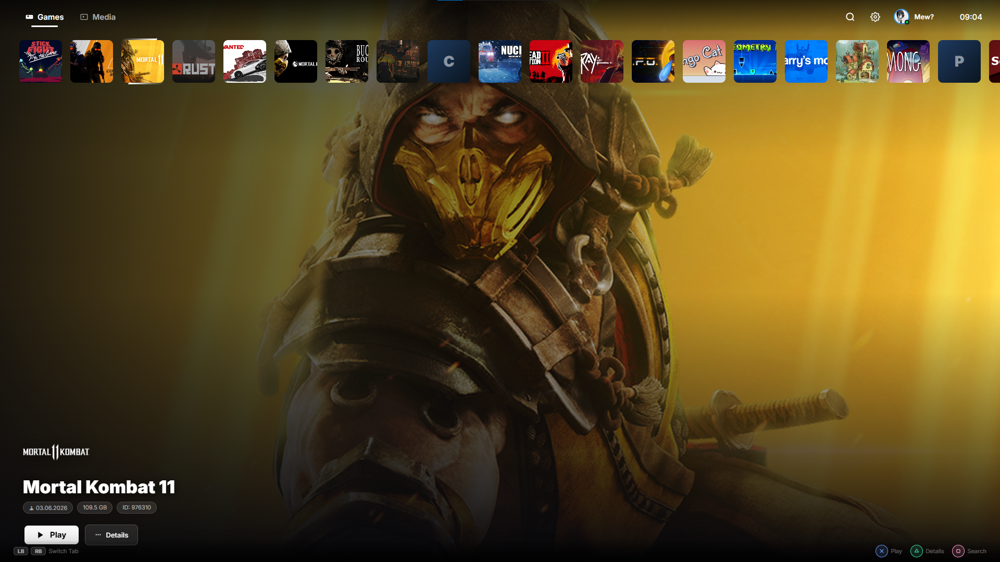

# MewStation (PS5-Style Steam Launcher)

MewStation is a beautiful, full-screen alternative launcher for your Steam library designed to mimic the modern console experience. It runs directly as a standalone Windows executable and is fully controllable via gamepads (DualShock, DualSense, Xbox).

## Features

- **Console Experience**: Fluid animations, native fullscreen Kiosk mode, ambient blurring, and sound hints.
- **Full Gamepad Support**: Built-in support for Xbox, DualSense (PS5), DualShock 4, native raw Generic DualShock 3 controllers, and iPega PG-9023 native mapping.
- **Smart Game Metadata**: Automatically parses your Steam library, pulling hi-res hero banners, capsules, and logos directly from Steam servers.

## Requirements

The provided executable `MewStation.exe` is self-contained. 
If running from source, you need Python 3.11+ and the packages listed in `requirements.txt`.

## How to Build

1. Ensure you have Python installed.
2. Double-click the provided `build_exe.bat`.
3. PyInstaller will compile all files (`server.py`, `gui.py`, `app.js`, `style.css`, `index.html`) into a single executable.
4. The output will be located in `dist/MewStation.exe`.

## Usage

- **Launch:** Double-click `MewStation.exe`. The launcher will start in the background and open a seamless fullscreen window via Edge/Chrome.
- **Navigate:** Use the D-Pad or Left Stick to move around. `Cross` (or `A`) to confirm, `Circle` (or `B`) to go back.
- **Settings:** Press `Start` or click the gear icon to open settings where you can change the controller mapping, calibrate buttons, or enable Steam Window Hiding.
- **Search:** Press `Square` (or `X`) to pull up the On-Screen Keyboard.

## License
MIT
